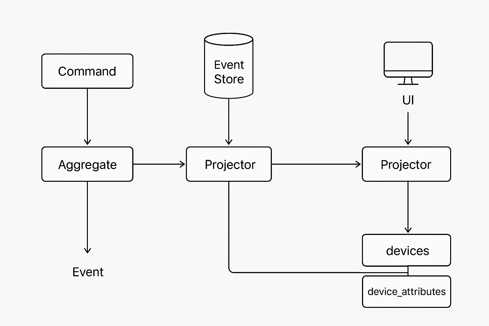

# Smart Home - CQRS & Event Sourcing Overview

## Overview
Smart Home is an application designed to manage smart devices in your home, like lights, thermostats, or sensors, using a powerful approach called Command Query Responsibility Segregation (CQRS) and Event Sourcing (ES). Instead of just storing the current state of devices, it keeps a history of every action (like turning a light on or setting a temperature) as events. This makes the system reliable, traceable, and easy to extend for new features. The focus is on controlling devices, tracking their status, and keeping a record of changes in a way that's simple to use and maintain.



## Key Features
- **Control Devices Easily**: Turn devices on/off or adjust settings like temperature or brightness.
- **Track Every Change**: Every action (e.g., turning on a light) is saved as an event, so you can see what happened and when.
- **Real-Time Updates**: Get instant notifications when a device's status changes, like when a sensor detects motion.
- **Reliable History**: If something goes wrong, you can rebuild the current state from the event history.
- **Flexible Queries**: Quickly check a device's current status or past changes without digging through complex data.
- **Scalable Design**: Add new devices or features without disrupting the system.

## Why CQRS & Event Sourcing?
- **CQRS**: Separates commands (actions like "turn on the light") from queries (checking the light's status). This keeps the system fast and organized.
- **Event Sourcing**: Instead of overwriting device states, every change is stored as an event (e.g., "Light Turned On at 8 PM"). This creates a full history, making it easy to track, debug, or even undo actions.
- **Smart Home Fit**: Perfect for smart homes where devices change often, and you need to know what happened when (e.g., "When did the thermostat last change?").

## Setup Instructions
To get Smart Home running, follow these simple steps:

 **Setup the Project**
   ```bash
   mix deps.get
   mix event_store.create
   mix event_store.init
   ```

## Create and migrate Read Database (for projections)
  ```bash
  mix ecto.create
  mix ecto.migrate
  ```
  
## 📈 Future Enhancements
 - **Add command validation middleware**
 - **Support snapshots for large aggregates**
 - **Web dashboard with live updates (Phoenix LiveView)**
 - **REST/GraphQL API layer**
 - **Device registration flow**
 - **Event versioning and migration tools**
